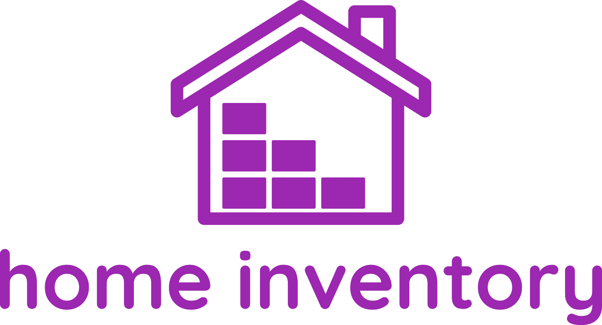

    

# About

Home inventory is a web application created with Angular that uses [home inventory api](https://github.com/KaZiUpl/home-inventory-app-backend/tree/master). It enables registered users to create containers (called houses and rooms) to store items that are either user-defined or globally defined in a database. It enables user to search items based on their barcodes with a use of device camera.

## Development server

Run `ng serve` for a dev server. Navigate to `https://localhost:4200/`. The app will automatically reload if you change any of the source files.

## Build

Run `ng build` to build the project. The build artifacts will be stored in the `dist/` directory. Use the `--prod` flag for a production build.

<!-- ## Running unit tests

Run `ng test` to execute the unit tests via [Karma](https://karma-runner.github.io). -->

<!-- ## Running end-to-end tests

Run `ng e2e` to execute the end-to-end tests via [Protractor](http://www.protractortest.org/). -->
